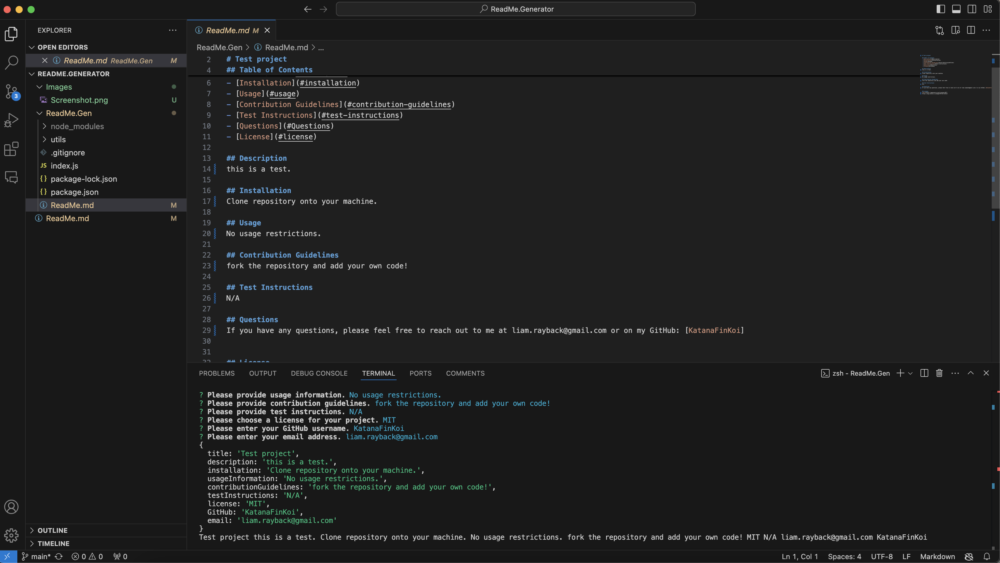

# ReadMe Generator

## Table of Contents
- [Description](#description)
- [Preview](#preview)
- [Installation](#installation)
- [Usage](#usage)
- [Contribution Guidelines](#contribution-guidelines)
- [Test Instructions](#test-instructions)
- [Questions](#Questions)
- [License](#license)

## Description
This code will ask questions to the user and then compile the answers into a professional Readme.md file

## Preview

## Installation
must install dependencies. "Inquirer", "Markdown", and "fs"

## Usage
may be used to create a professional Readme

## Contribution Guidelines
N/A

## Test Instructions
N/A

## Questions
If you have any questions, please feel free to reach out to me at liam.rayback@gmail.com or on my GitHub: [KatanaFinKoi]
A walkthrough video on how to use this code can be found here: https://demoair.wondershare.com/video/share?id=d6a8d070-227b-425a-81c1-cf65e9c81cf2

